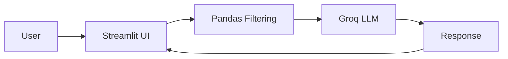

# 🛍️ AI-Powered Retail Product Recommendation Agent

---

## 📌 Problem Statement

Modern e-commerce platforms contain thousands of products.
Users often struggle to:

* Quickly find relevant products
* Filter by category, price, and color naturally
* Interact using conversational language instead of rigid filter systems
* Discover suitable recommendations efficiently

Traditional e-commerce filtering systems require manual selection of filters and lack conversational intelligence.

This project addresses the problem by building an **AI-powered conversational retail assistant** that:

* Reads structured product data from Excel
* Understands natural language queries
* Applies intelligent filtering
* Uses LLM (Groq + Llama 3.1) for human-like responses
* Provides a chat-based shopping experience

---

## 🚀 Solution Overview

This project implements an AI agent that:

1. Reads product data from an Excel file
2. Applies rule-based filtering using Pandas
3. Enhances responses using LLM (Groq API – Llama 3.1)
4. Provides a conversational interface using Streamlit

It simulates a real-world AI feature commonly integrated into modern e-commerce platforms — an intelligent shopping assistant.

---

## 🧠 Key Features

* 📊 Excel-based product database
* 🧮 Smart filtering using Pandas
* 🎨 Supports filtering by:

  * Category
  * Color
  * Price (e.g., "under 2000")
* 🤖 Conversational responses powered by Llama 3.1 (via Groq API)
* 💬 Interactive chat interface using Streamlit
* 🔐 Secure API key handling using python-dotenv

---

## 🛠️ Tech Stack

* Python
* Pandas
* OpenPyXL
* LangChain
* Groq API (Llama 3.1 Model)
* Streamlit
* python-dotenv

---
## 📂 Project Architecture


## 📂 Project Structure

```
Retail-Product-Chatbot/
│
├── app.py                # Streamlit UI
├── agent.py              # AI agent logic
├── data/
│   └── product.xlsx      # Product dataset
├── .env                  # API Key storage
├── requirements.txt
└── README.md
```

---

## ⚙️ Installation & Setup

### 1️⃣ Clone the Repository

```bash
git clone https://github.com/yourusername/retail-ai-agent.git
cd retail-ai-agent
```

---

### 2️⃣ Install Dependencies

```bash
pip install -r requirements.txt
```

---

### 3️⃣ Add Groq API Key

Create a `.env` file in the root directory:

```
GROQ_API_KEY=your_api_key_here
```

---

### 4️⃣ Run the Application

```bash
streamlit run app.py
```

---

##  Example Queries

* "Show me black shoes under 2000"
* "I want red tshirts"
* "Suggest jeans below 1500"
* "Do you have white bags?"

---

##  Real-World Application

This project demonstrates how conversational AI can enhance:

* E-commerce platforms
* Retail search systems
* AI customer support agents
* Product discovery engines

It reduces user friction and improves shopping experience through natural language interaction.

---

 

## 👨‍💻 Author

**Adnan Alam**
B.Tech – Information Technology
Aspiring AI/ML Engineer

---

 